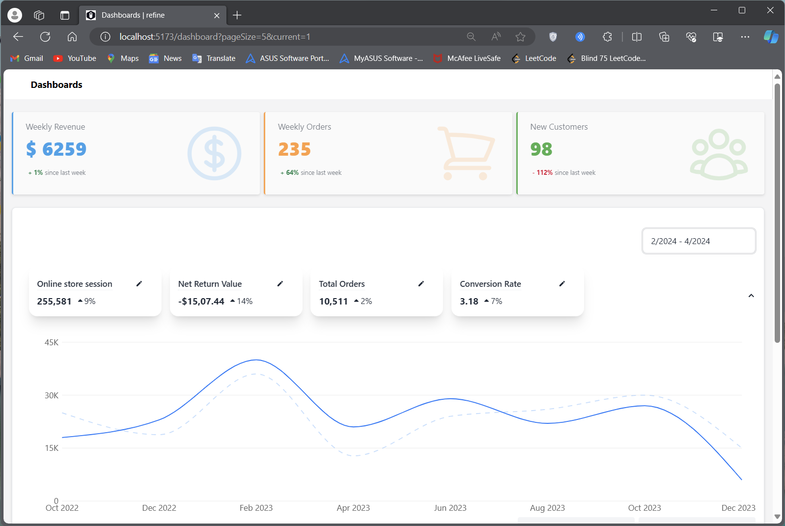
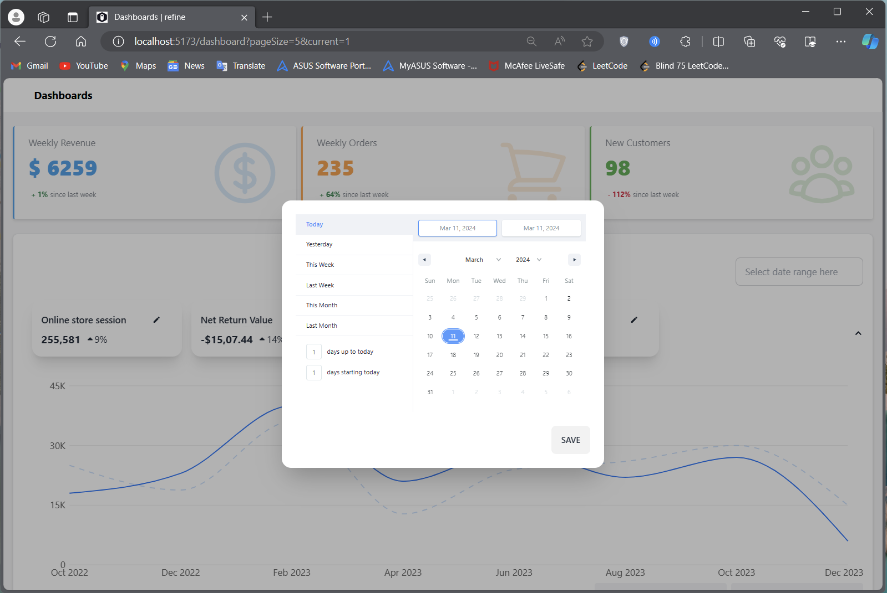

# Stats Dashboard

Welcome to  the Dashboard, which developed by the Shreya using Refine template. This advanced platform uses the Daisy UI, Tailwind CSS & ShadCn UI frameworks to improve the user interface and smoothly integrates charts with Chart.js and React-Chartjs-2. This Dashboard offers useful insights into sales patterns across clothing, accessories, and customer demographics through informative statistics and infographics.

## Table of Contents

- [Installation](#installation)
- [Content](#content)
- [Approach and Implementation](#approach)

## Installation

Run the following command to download the project:

1. **Clone the Repository:**

   ```bash
   git clone https://github.com/0shreyajha0/Stats-Dashboard.git
   ```

2. **Navigate to project folder**

   ```
   cd Stats-Dashboard
   ```

3. **Install Dependencies**

   ```
   npm install
   ```

4. **Run server**
   ```
   npm run dev
   ```

Your application will be accessible at http://localhost:5173 in your browser

## Content







## Approach and Implementation

1. First I downloaded the template from https://github.com/refinedev/refine
2. removed extra components like **GithubBaner** and link to pages like product and categories from nav bar and extra charts Fromm Index.tsx
3. In **ResponsiveAreaChart** component : to develop charts like given design changed AreaChart to LineChart from library of Recharts inside RespinsiveContainer
   and woked on its child compomnents - CartesianGrid , XAxis, YAxis, Line
   CartesianGrid : added false to vertical to remove vertical lines and added color to stroke
   XAxis and YAxis : removed axis lines and fixed tick count and tick format
   Line : Added/Edited needed properties like color , opacity , dots, stoke width
4. outsiide **ResponsiveContainer** added components to show date from to
5. Developed a new component **SessionCard** with props cardname, amount, rate
6. Added new component of **date range picker** on top of chart to allow user use range of date
