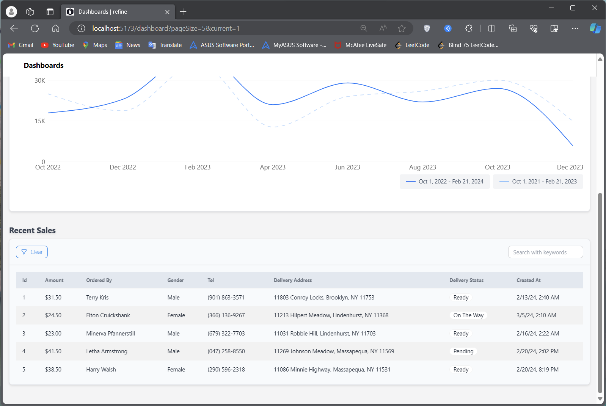

# Stats Dashboard

Welcome to  the Dashboard, which developed by the Shreya using Refine template. This advanced platform uses the Daisy UI, Tailwind CSS & ShadCn UI frameworks to improve the user interface and smoothly integrates charts with Chart.js and React-Chartjs-2. This Dashboard offers useful insights into sales patterns across clothing, accessories, and customer demographics through informative statistics and infographics.

## Table of Contents

- [Installation](#installation)
- [Content](#content)
- [Approach](#Approach)

## Installation

Run the following command to download the project:

1. **Clone the Repository:**

   ```bash
   git clone https://github.com/0shreyajha0/Stats-Dashboard.git
   ```

2. **Navigate to project folder**

   ```
   cd Stats-Dashboard
   ```

3. **Install Dependencies**

   ```
   npm install
   ```

4. **Run server**
   ```
   npm run dev
   ```

Your application will be accessible at http://localhost:5173 in your browser




## Usage

Guidelines for using your project.

## Configuration

Details on how to configure your project.
